# Webエンジニアのための API・HTTP・認証完全入門
## Spring Bootでログイン機能を作れるようになる本

作成日: 2026-06-27  
対象読者: Java / Spring Bootを学習中のWebエンジニア  
ゴール: HTTP・REST API・認証認可を理解し、Spring Bootでログイン機能つきAPIを実装できるようになる

---

## はじめに

Webアプリのログイン機能を作ろうとすると、急に知らない言葉が増えます。

- API
- HTTP
- REST
- Cookie
- Session
- JWT
- OAuth2
- OpenID Connect
- Spring Security
- 認証
- 認可
- CSRF
- CORS

最初は全部バラバラに見えます。

でも実際は、1本の線でつながっています。

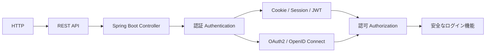

この本では、次の流れで学びます。

> 概念 → 図解 → HTTPメッセージ例 → Spring Bootコード → 演習問題

単なる暗記ではなく、実装に使える理解を目指します。

---

## この本の最終ゴール

読み終わるころには、次のことを説明・実装できる状態を目指します。

- APIとは何か説明できる
- HTTPリクエストとレスポンスを読める
- REST APIを設計できる
- Spring BootでControllerを作れる
- 認証と認可の違いを説明できる
- CookieとSessionの仕組みを説明できる
- JWTの構造と使いどころを説明できる
- OAuth2とOpenID Connectの違いを説明できる
- Spring Securityの基本構造を理解できる
- 会員登録・ログイン・ログアウト・権限制御を実装できる

---

# Part 1 Web通信の基礎

---

# 第1章 Web通信とは何か

## 1.1 概念

Web通信とは、クライアントとサーバーがネットワーク越しにデータをやり取りすることです。

クライアントとは、利用者側のアプリです。

- ブラウザ
- スマホアプリ
- Reactアプリ
- Vueアプリ
- curl
- Postman

サーバーとは、データや処理を提供する側のアプリです。

- Spring Boot
- Node.js
- Rails
- Go
- Python
- データベースに接続するバックエンド

Webアプリでは、多くの場合こうなります。

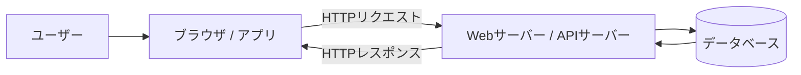

## 1.2 図解

ブラウザでWebページを開くとき、裏側では次のことが起きています。

```text
ユーザー
  ↓
ブラウザがURLにアクセス
  ↓
DNSでドメイン名をIPアドレスに変換
  ↓
サーバーへHTTPリクエストを送る
  ↓
サーバーがHTMLやJSONを返す
  ↓
ブラウザが表示する
```

## 1.3 HTTPメッセージ例

ブラウザがトップページを取得する例です。

```http
GET / HTTP/1.1
Host: example.com
Accept: text/html
```

サーバーの返答です。

```http
HTTP/1.1 200 OK
Content-Type: text/html

<html>
  <body>Hello</body>
</html>
```

## 1.4 Spring Bootで見ると

Spring Bootでは、HTTPリクエストをControllerで受け取ります。

```java
@RestController
public class HelloController {

    @GetMapping("/")
    public String hello() {
        return "Hello";
    }
}
```

`GET /` が来たら、`hello()` が呼ばれます。

## 1.5 演習問題

1. クライアントとは何か、自分の言葉で説明してください。
2. サーバーとは何か、自分の言葉で説明してください。
3. ブラウザでURLを開いたとき、裏側で何が起きるか順番に説明してください。
4. `GET /` は何を意味しますか？
5. Spring Bootの`@GetMapping("/")`は何を表していますか？

---

# 第2章 APIとは何か

## 2.1 概念

APIとは、Application Programming Interfaceの略です。

一言でいうと、

> 他のプログラムから利用するための窓口

です。

例えば、スマホアプリが天気情報を表示したいとします。

スマホアプリ自身は、天気データを持っていません。

そこで、天気情報を持っているサーバーに問い合わせます。

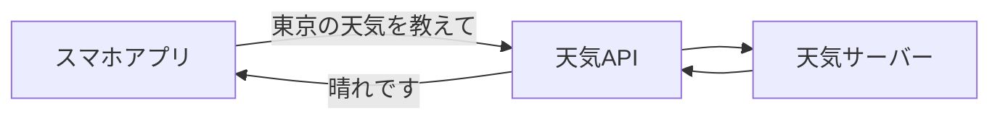

このとき、スマホアプリとサーバーの間にある「問い合わせの窓口」がAPIです。

## 2.2 APIは約束事

APIは、ただの通信ではありません。

> この形式でお願いしたら、この形式で返します

という約束です。

例です。

```http
GET /weather?city=tokyo
```

これは、

```text
東京の天気をください
```

という意味です。

サーバーは次のように返します。

```json
{
  "city": "tokyo",
  "weather": "sunny",
  "temperature": 28
}
```

## 2.3 APIはWebだけではない

JavaのメソッドもAPIです。

```java
String name = "Ryoma";
int length = name.length();
```

`length()` は、Javaが用意しているAPIです。

なぜなら、

> 文字列の長さを知りたいなら `length()` を呼んでください

という約束だからです。

## 2.4 APIの種類

APIにはいろいろな種類があります。

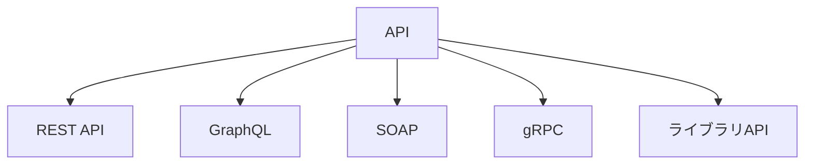

REST APIはAPIの一種です。

つまり、

```text
API = REST API
```

ではありません。

```text
REST API ⊂ API
```

です。

## 2.5 HTTPメッセージ例

ユーザー情報を取得するAPIです。

```http
GET /users/1 HTTP/1.1
Host: api.example.com
Accept: application/json
```

レスポンスです。

```http
HTTP/1.1 200 OK
Content-Type: application/json

{
  "id": 1,
  "name": "Ryoma"
}
```

## 2.6 Spring Bootコード

```java
@RestController
@RequestMapping("/users")
public class UserController {

    @GetMapping("/{id}")
    public UserResponse findById(@PathVariable Long id) {
        return new UserResponse(id, "Ryoma");
    }
}

public record UserResponse(Long id, String name) {}
```

## 2.7 演習問題

1. APIとは何ですか？
2. REST APIはAPIそのものですか？それともAPIの一種ですか？
3. Javaの`String.length()`がAPIといえる理由を説明してください。
4. `GET /users/1` は何を意味しますか？
5. APIを使うことで、なぜクライアントとサーバーを分離できますか？

---

# 第3章 HTTPとは何か

## 3.1 概念

HTTPは、HyperText Transfer Protocolの略です。

Webでデータをやり取りするための通信ルールです。

プロトコルとは、通信するときの決まりごとです。

電話でいうと、

```text
もしもし
こんにちは
用件を話す
失礼します
```

という流れがあります。

HTTPにも同じように、

```text
どのURLに
何をしたいか
追加情報は何か
データ本体は何か
```

というルールがあります。

## 3.2 HTTPはクライアント・サーバーモデル

HTTPでは、基本的にクライアントが先にリクエストを送ります。

サーバーはそれに対してレスポンスを返します。

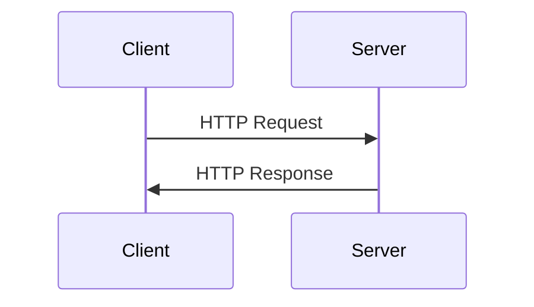

サーバーから勝手に話しかけるのではなく、クライアントのリクエストが起点になります。

## 3.3 HTTPリクエスト

HTTPリクエストは、クライアントからサーバーへのお願いです。

```http
GET /users/1 HTTP/1.1
Host: api.example.com
Accept: application/json
Authorization: Bearer xxxxx
```

構造は次のとおりです。

```text
リクエストライン
ヘッダー
空行
ボディ
```

GETの場合、ボディはないことが多いです。

## 3.4 HTTPレスポンス

HTTPレスポンスは、サーバーからクライアントへの返答です。

```http
HTTP/1.1 200 OK
Content-Type: application/json

{
  "id": 1,
  "name": "Ryoma"
}
```

構造は次のとおりです。

```text
ステータスライン
ヘッダー
空行
ボディ
```

## 3.5 HTTPは封筒

HTTPは、データそのものというより、データを運ぶ封筒です。

```text
封筒 = HTTP
宛先 = URL
目的 = HTTPメソッド
補足情報 = ヘッダー
中身 = ボディ
```

JSONは中身です。

HTTPは中身を運ぶルールです。

## 3.6 Spring Bootコード

```java
@RestController
@RequestMapping("/api")
public class ApiController {

    @GetMapping("/ping")
    public Map<String, String> ping() {
        return Map.of("message", "pong");
    }
}
```

リクエストです。

```http
GET /api/ping HTTP/1.1
Host: localhost:8080
Accept: application/json
```

レスポンスです。

```json
{
  "message": "pong"
}
```

## 3.7 演習問題

1. HTTPとは何ですか？
2. HTTPリクエストとは何ですか？
3. HTTPレスポンスとは何ですか？
4. HTTPを封筒に例えると、URL・メソッド・ヘッダー・ボディはそれぞれ何に相当しますか？
5. Spring BootでHTTPリクエストを受け取るクラスは何ですか？

---

# 第4章 HTTPメソッド

## 4.1 概念

HTTPメソッドは、

> サーバーに対して何をしたいか

を表します。

代表的なものは次のとおりです。

| メソッド | 意味 | CRUD |
|---|---|---|
| GET | 取得する | Read |
| POST | 作成する | Create |
| PUT | 全体更新する | Update |
| PATCH | 一部更新する | Update |
| DELETE | 削除する | Delete |

## 4.2 図解

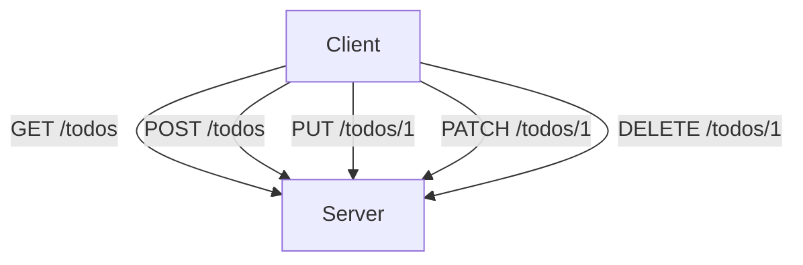

## 4.3 HTTPメッセージ例

### GET

```http
GET /todos/1 HTTP/1.1
Host: api.example.com
```

意味は、

```text
1番のTodoをください
```

です。

### POST

```http
POST /todos HTTP/1.1
Host: api.example.com
Content-Type: application/json

{
  "title": "HTTPを勉強する"
}
```

意味は、

```text
新しいTodoを作ってください
```

です。

### PUT

```http
PUT /todos/1 HTTP/1.1
Content-Type: application/json

{
  "title": "REST APIを勉強する",
  "completed": true
}
```

意味は、

```text
1番のTodoをこの内容に置き換えてください
```

です。

### PATCH

```http
PATCH /todos/1 HTTP/1.1
Content-Type: application/json

{
  "completed": true
}
```

意味は、

```text
1番のTodoの一部だけ更新してください
```

です。

### DELETE

```http
DELETE /todos/1 HTTP/1.1
Host: api.example.com
```

意味は、

```text
1番のTodoを削除してください
```

です。

## 4.4 Spring Bootコード

```java
@RestController
@RequestMapping("/todos")
public class TodoController {

    @GetMapping
    public List<TodoResponse> findAll() {
        return List.of();
    }

    @GetMapping("/{id}")
    public TodoResponse findById(@PathVariable Long id) {
        return new TodoResponse(id, "HTTPを勉強する", false);
    }

    @PostMapping
    public TodoResponse create(@RequestBody CreateTodoRequest request) {
        return new TodoResponse(1L, request.title(), false);
    }

    @PutMapping("/{id}")
    public TodoResponse update(@PathVariable Long id, @RequestBody UpdateTodoRequest request) {
        return new TodoResponse(id, request.title(), request.completed());
    }

    @DeleteMapping("/{id}")
    public void delete(@PathVariable Long id) {
    }
}

public record TodoResponse(Long id, String title, boolean completed) {}
public record CreateTodoRequest(String title) {}
public record UpdateTodoRequest(String title, boolean completed) {}
```

## 4.5 演習問題

1. GETは何をするメソッドですか？
2. POSTは何をするメソッドですか？
3. PUTとPATCHの違いは何ですか？
4. `DELETE /todos/1` は何を意味しますか？
5. Todoを新規作成するエンドポイントを設計してください。

---

# 第5章 HTTPステータスコード

## 5.1 概念

HTTPステータスコードは、サーバーの処理結果を数字で表したものです。

| 範囲 | 意味 |
|---|---|
| 2xx | 成功 |
| 3xx | リダイレクト |
| 4xx | クライアント側のエラー |
| 5xx | サーバー側のエラー |

## 5.2 よく使うステータスコード

| コード | 意味 | 使う場面 |
|---|---|---|
| 200 | OK | 取得・更新成功 |
| 201 | Created | 作成成功 |
| 204 | No Content | 削除成功など、返す本文がない |
| 400 | Bad Request | リクエスト形式が不正 |
| 401 | Unauthorized | 認証が必要 |
| 403 | Forbidden | 権限がない |
| 404 | Not Found | 対象が存在しない |
| 409 | Conflict | データが競合している |
| 422 | Unprocessable Content | 入力値の意味が不正 |
| 500 | Internal Server Error | サーバー内部エラー |

## 5.3 401と403の違い

ここは重要です。

```text
401 Unauthorized
= あなたが誰かわからない。ログインしてください。

403 Forbidden
= あなたが誰かはわかる。でも、その操作をする権限がありません。
```

例です。

```text
未ログインで /api/me にアクセス
→ 401

一般ユーザーで /api/admin/users にアクセス
→ 403
```

## 5.4 HTTPメッセージ例

```http
HTTP/1.1 404 Not Found
Content-Type: application/json

{
  "code": "TODO_NOT_FOUND",
  "message": "Todoが見つかりません"
}
```

## 5.5 Spring Bootコード

```java
@ResponseStatus(HttpStatus.NOT_FOUND)
public class TodoNotFoundException extends RuntimeException {
    public TodoNotFoundException(Long id) {
        super("Todo not found: " + id);
    }
}
```

```java
@RestControllerAdvice
public class ApiExceptionHandler {

    @ExceptionHandler(TodoNotFoundException.class)
    public ResponseEntity<ApiError> handleTodoNotFound(TodoNotFoundException e) {
        return ResponseEntity
                .status(HttpStatus.NOT_FOUND)
                .body(new ApiError("TODO_NOT_FOUND", e.getMessage()));
    }
}

public record ApiError(String code, String message) {}
```

## 5.6 演習問題

1. 200と201の違いは何ですか？
2. 400と404の違いは何ですか？
3. 401と403の違いは何ですか？
4. Todoが存在しない場合、どのステータスコードを返すべきですか？
5. サーバーで予期しない例外が起きた場合、どのステータスコードになりますか？

---

# 第6章 JSON

## 6.1 概念

JSONは、JavaScript Object Notationの略です。

データを表すための軽量な形式です。

REST APIでは、リクエストやレスポンスのボディとしてよく使われます。

```json
{
  "id": 1,
  "name": "Ryoma",
  "roles": ["USER", "ADMIN"]
}
```

## 6.2 JSONの基本ルール

- キーは文字列
- 文字列はダブルクォートで囲む
- オブジェクトは`{}`
- 配列は`[]`
- 数値、真偽値、nullを扱える

## 6.3 Javaオブジェクトとの変換

APIでは、JSONとJavaオブジェクトを相互変換します。

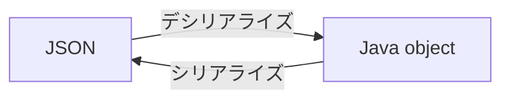

Spring Bootでは、通常Jacksonがこの変換を担当します。

## 6.4 HTTPメッセージ例

```http
POST /users HTTP/1.1
Content-Type: application/json

{
  "name": "Ryoma",
  "email": "ryoma@example.com"
}
```

## 6.5 Spring Bootコード

```java
@PostMapping("/users")
public UserResponse create(@RequestBody CreateUserRequest request) {
    return new UserResponse(1L, request.name(), request.email());
}

public record CreateUserRequest(String name, String email) {}
public record UserResponse(Long id, String name, String email) {}
```

## 6.6 演習問題

1. JSONとは何ですか？
2. `Content-Type: application/json` は何を意味しますか？
3. シリアライズとは何ですか？
4. デシリアライズとは何ですか？
5. Spring BootでJSONのリクエストボディをJavaに変換するには何を使いますか？

---

# Part 2 REST API設計

---

# 第7章 RESTとは何か

## 7.1 概念

RESTは、Representational State Transferの略です。

REST APIとは、RESTという設計思想に沿って作られたAPIです。

ざっくり言うと、RESTでは次のように考えます。

> URLはリソースを表し、操作はHTTPメソッドで表す

## 7.2 リソースとは

リソースとは、APIで扱う対象のことです。

例えばTodoアプリなら、リソースは次のようなものです。

- ユーザー
- Todo
- コメント
- ラベル

RESTでは、リソースをURLで表します。

```text
/users
/users/1
/todos
/todos/1
```

## 7.3 悪いURLと良いURL

悪い例です。

```text
/getUser
/createTodo
/deleteTodo
```

URLに操作が入っています。

RESTらしい例です。

```text
GET /users/1
POST /todos
DELETE /todos/1
```

操作はHTTPメソッドで表し、URLはリソースを表しています。

## 7.4 図解

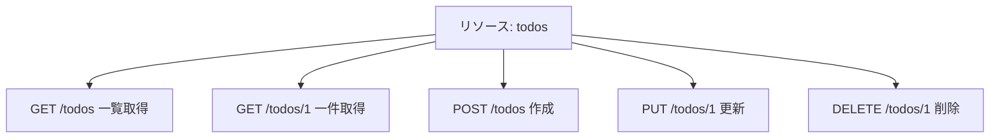

## 7.5 HTTPメッセージ例

```http
GET /todos/1 HTTP/1.1
Accept: application/json
```

```http
HTTP/1.1 200 OK
Content-Type: application/json

{
  "id": 1,
  "title": "RESTを理解する",
  "completed": false
}
```

## 7.6 Spring Bootコード

```java
@RestController
@RequestMapping("/api/todos")
public class TodoRestController {

    @GetMapping("/{id}")
    public TodoResponse getTodo(@PathVariable Long id) {
        return new TodoResponse(id, "RESTを理解する", false);
    }
}
```

## 7.7 演習問題

1. RESTではURLは何を表すべきですか？
2. 操作は何で表すべきですか？
3. `/getUser` がRESTらしくない理由を説明してください。
4. ユーザー一覧取得のREST APIを設計してください。
5. ユーザー削除のREST APIを設計してください。

---

# 第8章 REST API設計の実務ルール

## 8.1 エンドポイント命名

基本は名詞の複数形を使います。

```text
/users
/todos
/orders
/products
```

単数形より複数形にそろえると、一覧と一件取得が自然になります。

```text
GET /users
GET /users/1
```

## 8.2 ネストしたリソース

ユーザーのTodoを表す場合です。

```text
GET /users/1/todos
```

ただし、ネストしすぎると読みにくくなります。

避けたい例です。

```text
/users/1/projects/2/tasks/3/comments/4
```

この場合は、主役のリソースを前に出します。

```text
GET /comments/4
GET /tasks/3/comments
```

## 8.3 ページネーション

一覧取得では、件数が増えると一度に返せません。

そのため、ページネーションを使います。

```http
GET /todos?page=0&size=20
```

レスポンス例です。

```json
{
  "items": [
    {
      "id": 1,
      "title": "HTTPを学ぶ"
    }
  ],
  "page": 0,
  "size": 20,
  "totalElements": 100
}
```

## 8.4 フィルタリング

```http
GET /todos?completed=false
```

未完了のTodoだけ取得します。

## 8.5 ソート

```http
GET /todos?sort=createdAt,desc
```

作成日時の降順で取得します。

## 8.6 バージョニング

APIの仕様変更に備える場合、URLにバージョンを含めることがあります。

```text
/api/v1/todos
/api/v2/todos
```

## 8.7 Spring Bootコード

```java
@GetMapping
public Page<TodoResponse> findAll(
        @RequestParam(defaultValue = "0") int page,
        @RequestParam(defaultValue = "20") int size,
        @RequestParam(required = false) Boolean completed
) {
    return Page.empty();
}
```

## 8.8 演習問題

1. REST APIのURLでは動詞と名詞のどちらを使うべきですか？
2. ページネーションが必要な理由を説明してください。
3. 未完了Todoだけ取得するURLを設計してください。
4. 作成日時降順でTodoを取得するURLを設計してください。
5. APIバージョニングが必要になる場面を説明してください。

---

# 第9章 バリデーションとエラー設計

## 9.1 概念

APIでは、クライアントから不正な値が送られてくることを前提にします。

例えば、

```json
{
  "email": "not-email",
  "password": ""
}
```

このような入力をそのまま処理してはいけません。

## 9.2 バリデーションの役割

バリデーションとは、入力値がルールを満たしているか確認することです。

- 必須項目か
- 文字数は正しいか
- メール形式か
- 数値範囲は正しいか
- 禁止文字を含まないか

## 9.3 HTTPメッセージ例

```http
POST /api/auth/register HTTP/1.1
Content-Type: application/json

{
  "email": "wrong",
  "password": ""
}
```

レスポンス例です。

```http
HTTP/1.1 400 Bad Request
Content-Type: application/json

{
  "code": "VALIDATION_ERROR",
  "message": "入力値が不正です",
  "fields": {
    "email": "メールアドレス形式で入力してください",
    "password": "8文字以上で入力してください"
  }
}
```

## 9.4 Spring Bootコード

```java
public record RegisterRequest(
        @NotBlank
        @Email
        String email,

        @NotBlank
        @Size(min = 8, max = 72)
        String password
) {}
```

```java
@PostMapping("/register")
public ResponseEntity<Void> register(@Valid @RequestBody RegisterRequest request) {
    return ResponseEntity.status(HttpStatus.CREATED).build();
}
```

```java
@RestControllerAdvice
public class ValidationErrorHandler {

    @ExceptionHandler(MethodArgumentNotValidException.class)
    public ResponseEntity<ValidationErrorResponse> handle(MethodArgumentNotValidException e) {
        Map<String, String> fields = new LinkedHashMap<>();

        for (FieldError error : e.getBindingResult().getFieldErrors()) {
            fields.put(error.getField(), error.getDefaultMessage());
        }

        return ResponseEntity.badRequest()
                .body(new ValidationErrorResponse(
                        "VALIDATION_ERROR",
                        "入力値が不正です",
                        fields
                ));
    }
}

public record ValidationErrorResponse(
        String code,
        String message,
        Map<String, String> fields
) {}
```

## 9.5 演習問題

1. バリデーションとは何ですか？
2. メールアドレスの形式チェックにはどのアノテーションを使いますか？
3. パスワードの最小文字数チェックにはどのアノテーションを使いますか？
4. バリデーションエラーは何番のステータスコードで返すことが多いですか？
5. エラーレスポンスに`code`を入れるメリットを説明してください。

---

# Part 3 認証・認可の基礎

---

# 第10章 認証と認可

## 10.1 概念

認証と認可は似ていますが、意味は違います。

```text
認証 Authentication
= あなたは誰ですか？

認可 Authorization
= あなたは何をしていいですか？
```

## 10.2 例

ログインは認証です。

```text
メールアドレスとパスワードを確認する
↓
本人だと判断する
```

管理者画面に入れるか確認するのは認可です。

```text
ログイン済み
↓
この人はADMIN権限を持っているか確認する
```

## 10.3 図解

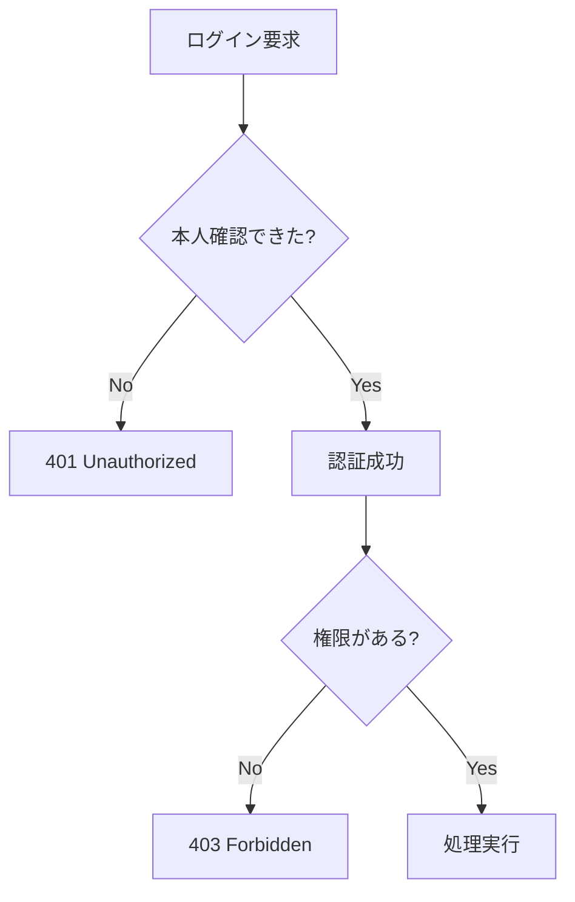

## 10.4 HTTPメッセージ例

未ログインです。

```http
GET /api/me HTTP/1.1
```

```http
HTTP/1.1 401 Unauthorized
```

ログイン済みだが管理者ではありません。

```http
GET /api/admin/users HTTP/1.1
Authorization: Bearer xxxxx
```

```http
HTTP/1.1 403 Forbidden
```

## 10.5 Spring Bootコード

```java
@RestController
@RequestMapping("/api")
public class MeController {

    @GetMapping("/me")
    public Map<String, String> me(Authentication authentication) {
        return Map.of("username", authentication.getName());
    }
}
```

```java
@Configuration
@EnableMethodSecurity
public class SecurityConfig {

    @Bean
    SecurityFilterChain securityFilterChain(HttpSecurity http) throws Exception {
        return http
                .authorizeHttpRequests(auth -> auth
                        .requestMatchers("/api/public/**").permitAll()
                        .requestMatchers("/api/admin/**").hasRole("ADMIN")
                        .anyRequest().authenticated()
                )
                .build();
    }
}
```

## 10.6 演習問題

1. 認証とは何ですか？
2. 認可とは何ですか？
3. 401はどんな場面で使いますか？
4. 403はどんな場面で使いますか？
5. 管理者だけアクセスできるAPIを作る場合、認証と認可のどちらが必要ですか？

---

# 第11章 Cookie

## 11.1 概念

Cookieは、ブラウザに保存される小さなデータです。

サーバーはレスポンスヘッダーでCookieをセットします。

ブラウザは次回以降のリクエストで、そのCookieを自動的に送ります。

## 11.2 図解

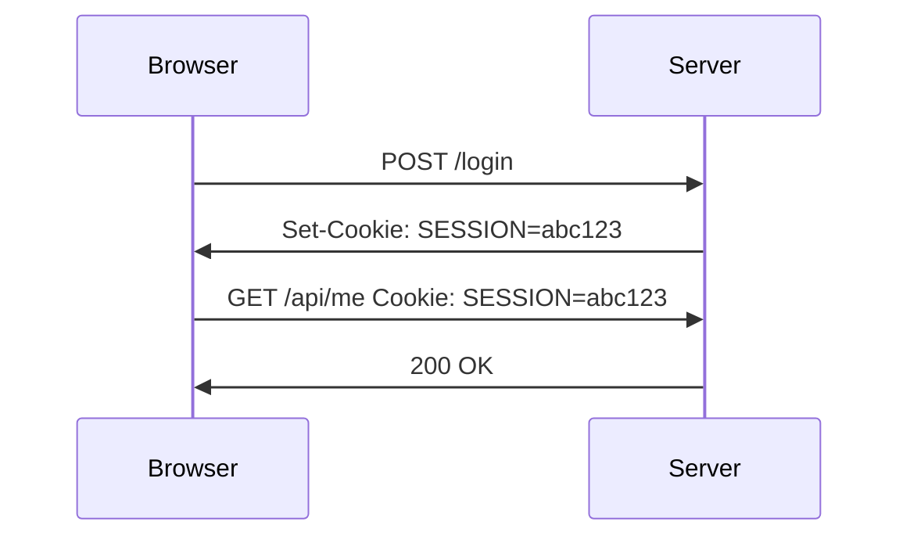

## 11.3 HTTPメッセージ例

ログイン成功時にCookieをセットします。

```http
HTTP/1.1 200 OK
Set-Cookie: SESSION=abc123; Path=/; HttpOnly; Secure; SameSite=Lax
```

次回以降、ブラウザはCookieを送ります。

```http
GET /api/me HTTP/1.1
Cookie: SESSION=abc123
```

## 11.4 Cookieの重要属性

| 属性 | 意味 |
|---|---|
| HttpOnly | JavaScriptからCookieを読めなくする |
| Secure | HTTPS通信でのみCookieを送る |
| SameSite | クロスサイトリクエスト時にCookieを送るか制御する |
| Max-Age / Expires | 有効期限 |
| Path | Cookieを送るパス範囲 |
| Domain | Cookieを送るドメイン範囲 |

## 11.5 Spring Bootコード

```java
@PostMapping("/login-cookie-demo")
public ResponseEntity<Void> loginCookieDemo(HttpServletResponse response) {
    ResponseCookie cookie = ResponseCookie.from("SESSION", "abc123")
            .httpOnly(true)
            .secure(true)
            .sameSite("Lax")
            .path("/")
            .maxAge(Duration.ofHours(1))
            .build();

    response.addHeader(HttpHeaders.SET_COOKIE, cookie.toString());
    return ResponseEntity.ok().build();
}
```

## 11.6 Cookieの注意点

Cookieは便利ですが、攻撃対象にもなります。

特に注意する攻撃です。

- XSS
- CSRF
- セッション固定攻撃
- Cookie盗難

そのため、ログイン用Cookieには基本的に次を付けます。

```text
HttpOnly
Secure
SameSite
```

## 11.7 演習問題

1. Cookieはどこに保存されますか？
2. `Set-Cookie` はリクエストヘッダーですか？レスポンスヘッダーですか？
3. `HttpOnly` の役割は何ですか？
4. `Secure` の役割は何ですか？
5. ブラウザは次回以降Cookieを手動で送る必要がありますか？

---

# 第12章 Session

## 12.1 概念

Sessionは、サーバー側にユーザーの状態を保存する仕組みです。

HTTPはステートレスなので、サーバーは前回の通信を覚えていません。

そこで、Sessionを使ってログイン状態を管理します。

## 12.2 Sessionの流れ

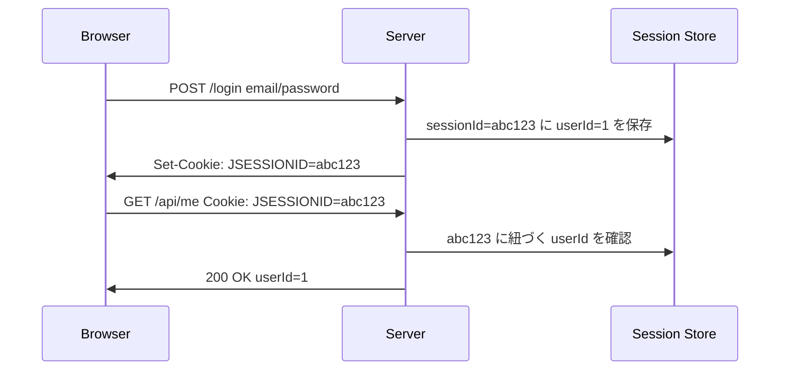

## 12.3 SessionとCookieの関係

よく混乱します。

```text
Cookie
= ブラウザ側に保存する小さなデータ

Session
= サーバー側に保存するログイン状態
```

Session認証では、CookieにはSession IDだけを入れます。

ユーザー情報本体はサーバー側に保存します。

## 12.4 HTTPメッセージ例

```http
HTTP/1.1 200 OK
Set-Cookie: JSESSIONID=abc123; Path=/; HttpOnly
```

```http
GET /api/me HTTP/1.1
Cookie: JSESSIONID=abc123
```

## 12.5 Spring Securityのフォームログイン例

```java
@Configuration
public class SessionSecurityConfig {

    @Bean
    SecurityFilterChain sessionSecurity(HttpSecurity http) throws Exception {
        return http
                .authorizeHttpRequests(auth -> auth
                        .requestMatchers("/", "/login", "/css/**").permitAll()
                        .anyRequest().authenticated()
                )
                .formLogin(Customizer.withDefaults())
                .logout(Customizer.withDefaults())
                .build();
    }

    @Bean
    PasswordEncoder passwordEncoder() {
        return new BCryptPasswordEncoder();
    }
}
```

## 12.6 Session認証が向いているケース

- ブラウザ中心のWebアプリ
- サーバー側でログイン状態を管理したい
- ログアウトや強制失効を簡単にしたい
- 社内システム
- 管理画面

## 12.7 Session認証の弱点

- サーバー側に状態を持つため、スケール時に工夫が必要
- 複数サーバー構成ではSession共有が必要
- Cookieを使うためCSRF対策が重要
- SPAやスマホアプリでは設計に注意が必要

## 12.8 演習問題

1. Sessionはどこに保存されますか？
2. CookieとSessionの違いを説明してください。
3. Session IDは何のために使いますか？
4. Session認証が向いているアプリを1つ挙げてください。
5. Session認証でCSRF対策が重要な理由を考えてください。

---

# 第13章 JWT

## 13.1 概念

JWTは、JSON Web Tokenの略です。

認証・認可の文脈では、ユーザー情報や権限などの「主張」を含んだトークンとして使われます。

JWTは次のような形をしています。

```text
xxxxx.yyyyy.zzzzz
```

ドットで3つに分かれています。

```text
Header.Payload.Signature
```

## 13.2 JWTの構造

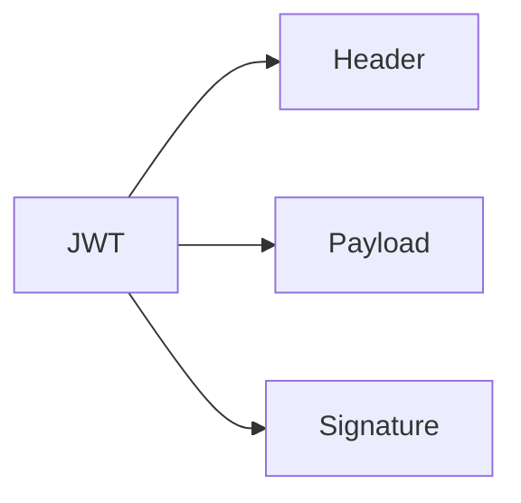

### Header

どのアルゴリズムで署名しているかなどを表します。

```json
{
  "alg": "HS256",
  "typ": "JWT"
}
```

### Payload

ユーザー情報や有効期限などを表します。

```json
{
  "sub": "1",
  "email": "ryoma@example.com",
  "roles": ["USER"],
  "exp": 1893456000
}
```

### Signature

HeaderとPayloadが改ざんされていないか確認するための署名です。

## 13.3 JWTは暗号化ではない

とても大事です。

署名付きJWTは、改ざん検知はできます。

しかし、PayloadはBase64URLでエンコードされているだけで、暗号化ではありません。

そのため、JWTのPayloadに次のような情報を入れてはいけません。

- パスワード
- クレジットカード番号
- 秘密情報
- 個人情報を過剰に含むデータ

## 13.4 HTTPメッセージ例

ログインします。

```http
POST /api/auth/login HTTP/1.1
Content-Type: application/json

{
  "email": "ryoma@example.com",
  "password": "password123"
}
```

サーバーがアクセストークンを返します。

```json
{
  "accessToken": "xxxxx.yyyyy.zzzzz",
  "tokenType": "Bearer"
}
```

以降のリクエストでは、Authorizationヘッダーに入れます。

```http
GET /api/me HTTP/1.1
Authorization: Bearer xxxxx.yyyyy.zzzzz
```

## 13.5 Access TokenとRefresh Token

JWT認証では、よく2種類のトークンを使います。

| 種類 | 用途 | 有効期限 |
|---|---|---|
| Access Token | APIアクセスに使う | 短い |
| Refresh Token | Access Tokenの再発行に使う | 長い |

基本方針は、

```text
Access Tokenは短命
Refresh Tokenは厳重に管理
```

です。

## 13.6 Spring BootでのJWT認証の考え方

Spring SecurityでJWTを扱う方法は大きく2つあります。

### 方式A: OAuth2 Resource ServerとしてJWTを検証する

外部の認可サーバーやIdPがJWTを発行し、Spring Boot側は検証だけします。

```java
@Configuration
public class JwtResourceServerSecurityConfig {

    @Bean
    SecurityFilterChain securityFilterChain(HttpSecurity http) throws Exception {
        return http
                .authorizeHttpRequests(auth -> auth
                        .requestMatchers("/api/public/**").permitAll()
                        .anyRequest().authenticated()
                )
                .oauth2ResourceServer(oauth2 -> oauth2.jwt(Customizer.withDefaults()))
                .build();
    }
}
```

この方式は実務でよく使われます。

### 方式B: 自前でJWTを発行・検証する

学習や小規模APIでは、自前でJWTを発行する構成もあります。

ただし、本番では鍵管理・失効・更新・漏洩対策が必要です。

## 13.7 JWT認証が向いているケース

- REST API
- SPA
- スマホアプリ
- マイクロサービス
- 外部認可サーバーと連携する構成

## 13.8 JWT認証の弱点

- 発行後の即時失効が難しい
- 盗まれると有効期限までは使われる可能性がある
- Payloadに情報を詰め込みすぎる危険がある
- Refresh Tokenの管理が難しい

## 13.9 演習問題

1. JWTは何の略ですか？
2. JWTは何個のパートに分かれますか？
3. JWTのPayloadにパスワードを入れてはいけない理由を説明してください。
4. Access TokenとRefresh Tokenの違いを説明してください。
5. JWTがSessionより向いているケースを1つ挙げてください。

---

# 第14章 Cookie認証・Session認証・JWT認証の比較

## 14.1 比較表

| 観点 | Cookie | Session | JWT |
|---|---|---|---|
| 保存場所 | ブラウザ | サーバー | クライアント側 |
| 実体 | 小さなデータ | ログイン状態 | 署名付きトークン |
| サーバー状態 | なし | あり | 基本なし |
| 失効 | Cookie削除 | サーバー側で削除 | 工夫が必要 |
| ブラウザとの相性 | 良い | 良い | 設計次第 |
| スマホアプリとの相性 | 普通 | 普通 | 良い |
| CSRF | 注意 | 注意 | Cookie保存なら注意 |
| XSS | 注意 | 注意 | 保存場所に注意 |

## 14.2 選び方

### 管理画面・社内Webアプリ

Session認証が扱いやすいです。

```text
Spring Security formLogin
+
Session
+
CSRF有効
```

### REST API + SPA

選択肢が分かれます。

```text
案A: Session Cookie
案B: JWT Bearer Token
案C: BFF構成
```

セキュリティを考えると、単純な「localStorageにJWT保存」は慎重に判断すべきです。

### スマホアプリ

JWTやOAuth2/OIDCとの相性が良いです。

## 14.3 図解

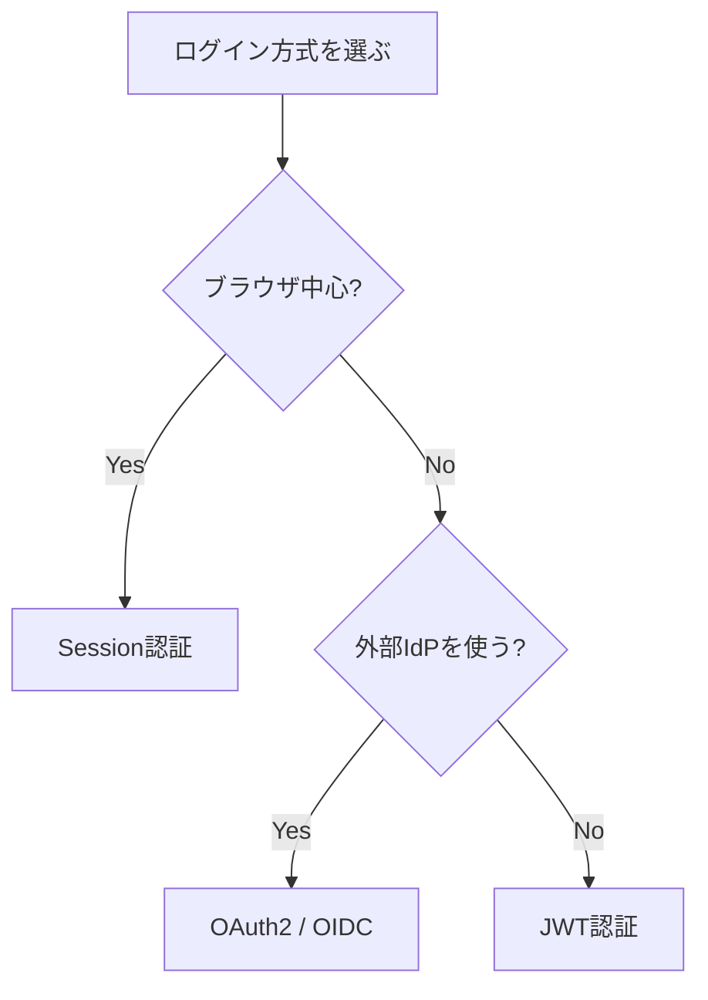

## 14.4 演習問題

1. Session認証が管理画面に向いている理由を説明してください。
2. JWT認証がスマホアプリに向いている理由を説明してください。
3. JWTをlocalStorageに保存する場合、どんな攻撃に注意が必要ですか？
4. Cookieを使う認証で注意すべき攻撃は何ですか？
5. 自分が作るTodoアプリなら、どの認証方式を選びますか？理由も書いてください。

---

# Part 4 OAuth2とOpenID Connect

---

# 第15章 OAuth2

## 15.1 概念

OAuth2は、認可のためのフレームワークです。

認可とは、

> あるアプリに、限定された権限を与えること

です。

よくある例は、

```text
このアプリにGoogleカレンダーの読み取りを許可しますか？
```

という画面です。

これは「ログイン」ではなく、本質的には「権限付与」です。

## 15.2 登場人物

OAuth2には主に次の登場人物がいます。

| 名前 | 役割 |
|---|---|
| Resource Owner | ユーザー本人 |
| Client | 権限をほしいアプリ |
| Authorization Server | 認可を担当するサーバー |
| Resource Server | APIを提供するサーバー |

Google連携で考えると、

```text
Resource Owner = ユーザー
Client = 自分のアプリ
Authorization Server = Googleの認可サーバー
Resource Server = Google API
```

## 15.3 認可コードフロー

Webアプリでよく使われるのが、認可コードフローです。

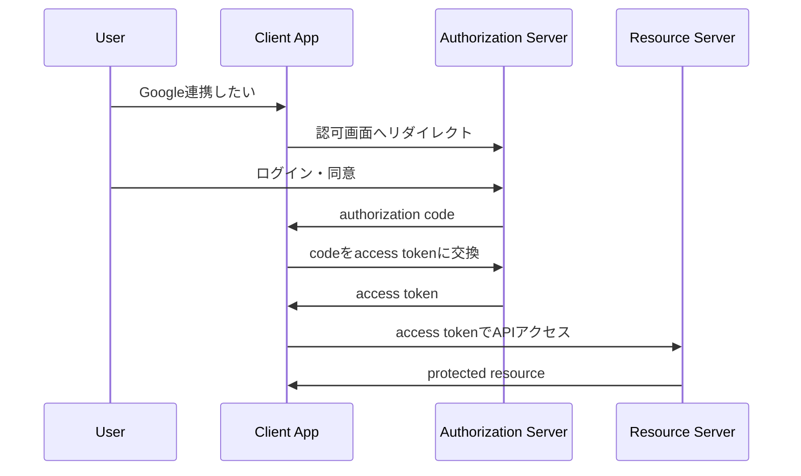

## 15.4 HTTPメッセージ例

認可リクエストです。

```http
GET /authorize?
  response_type=code&
  client_id=client123&
  redirect_uri=https://app.example.com/callback&
  scope=profile email&
  state=random123
```

認可サーバーは、認可コードを付けて戻します。

```http
GET /callback?code=abc123&state=random123
```

クライアントはコードをトークンに交換します。

```http
POST /token HTTP/1.1
Content-Type: application/x-www-form-urlencoded

grant_type=authorization_code&
code=abc123&
redirect_uri=https://app.example.com/callback&
client_id=client123
```

## 15.5 stateとPKCE

OAuth2では、攻撃対策として`state`やPKCEが重要です。

### state

CSRFのような攻撃を防ぐために使います。

```text
認可開始時にランダム値を作る
↓
戻ってきたときに同じ値か確認する
```

### PKCE

認可コードを盗まれても、トークン交換を難しくする仕組みです。

特にSPAやモバイルアプリで重要です。

## 15.6 Spring Bootコード

Googleログインなどを使う場合、Spring SecurityのOAuth2 Client機能を利用します。

```java
@Configuration
public class OAuth2LoginSecurityConfig {

    @Bean
    SecurityFilterChain securityFilterChain(HttpSecurity http) throws Exception {
        return http
                .authorizeHttpRequests(auth -> auth
                        .requestMatchers("/", "/login").permitAll()
                        .anyRequest().authenticated()
                )
                .oauth2Login(Customizer.withDefaults())
                .build();
    }
}
```

設定例です。

```yaml
spring:
  security:
    oauth2:
      client:
        registration:
          google:
            client-id: ${GOOGLE_CLIENT_ID}
            client-secret: ${GOOGLE_CLIENT_SECRET}
            scope:
              - openid
              - profile
              - email
```

## 15.7 演習問題

1. OAuth2は認証と認可のどちらのための仕組みですか？
2. Resource Ownerとは誰ですか？
3. Clientとは何ですか？
4. Authorization Serverとは何ですか？
5. 認可コードフローの流れを5ステップで説明してください。

---

# 第16章 OpenID Connect

## 16.1 概念

OpenID Connectは、OAuth2の上に作られた認証のための仕組みです。

OAuth2だけでは、

```text
このアプリにAPIアクセスを許可する
```

ことはできます。

しかし、

```text
ログインしたユーザーが誰かを標準的に伝える
```

仕組みとしては不十分です。

そこでOpenID Connectが登場します。

## 16.2 OAuth2とOpenID Connectの違い

```text
OAuth2
= 認可
= 何をしていいか

OpenID Connect
= 認証
= あなたは誰か
```

## 16.3 ID Token

OpenID Connectの中心はID Tokenです。

ID Tokenは、認証結果を表すJWTです。

Payloadには次のような情報が含まれます。

```json
{
  "iss": "https://accounts.google.com",
  "sub": "1234567890",
  "aud": "client-id",
  "email": "ryoma@example.com",
  "name": "Ryoma",
  "exp": 1893456000
}
```

重要なのは、ID TokenはAPIアクセス用ではなく、

```text
ユーザーが認証されたことをクライアントに伝えるためのトークン
```

だということです。

## 16.4 Access TokenとID Tokenの違い

| トークン | 目的 | 主な受け取り手 |
|---|---|---|
| Access Token | APIアクセスの許可 | Resource Server |
| ID Token | ユーザー認証結果 | Client |

## 16.5 HTTPメッセージ例

OpenID Connectを使う場合、scopeに`openid`を含めます。

```http
GET /authorize?
  response_type=code&
  client_id=client123&
  scope=openid profile email&
  redirect_uri=https://app.example.com/callback
```

トークンレスポンス例です。

```json
{
  "access_token": "access.xxxxx",
  "id_token": "id.yyyyy",
  "token_type": "Bearer",
  "expires_in": 3600
}
```

## 16.6 Spring Bootでログインユーザーを取得

```java
@RestController
@RequestMapping("/api")
public class OidcMeController {

    @GetMapping("/oidc/me")
    public Map<String, Object> me(@AuthenticationPrincipal OidcUser oidcUser) {
        return Map.of(
                "name", oidcUser.getFullName(),
                "email", oidcUser.getEmail(),
                "subject", oidcUser.getSubject()
        );
    }
}
```

## 16.7 演習問題

1. OpenID Connectは何のための仕組みですか？
2. OAuth2とOpenID Connectの違いを説明してください。
3. ID Tokenは何を表しますか？
4. ID Tokenは何形式で表されることが多いですか？
5. `scope=openid` を付ける意味を説明してください。

---

# Part 5 Spring Security

---

# 第17章 Spring Securityの全体像

## 17.1 概念

Spring Securityは、Springアプリケーションに認証・認可・攻撃対策を追加するためのフレームワークです。

主な役割です。

- ログイン処理
- パスワード検証
- ログアウト
- 認証済みユーザーの管理
- URLごとのアクセス制御
- メソッドごとのアクセス制御
- CSRF対策
- セキュリティヘッダー
- OAuth2 Login
- JWT Resource Server

## 17.2 Filter Chain

Spring Securityの中心はFilter Chainです。

HTTPリクエストがControllerに届く前に、複数のFilterを通ります。

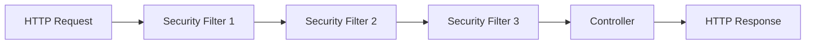

Filter Chainで行われることです。

- 認証情報を取り出す
- トークンを検証する
- ログイン済みか確認する
- 権限があるか確認する
- SecurityContextにユーザー情報を入れる

## 17.3 SecurityContext

認証済みユーザーの情報は、SecurityContextに入ります。

Controllerでは、`Authentication`として取得できます。

```java
@GetMapping("/me")
public String me(Authentication authentication) {
    return authentication.getName();
}
```

## 17.4 UserDetailsService

メールアドレスとパスワードでログインする場合、ユーザー情報をDBから取得する必要があります。

その役割を担うのが`UserDetailsService`です。

```java
@Service
public class CustomUserDetailsService implements UserDetailsService {

    private final AppUserRepository userRepository;

    public CustomUserDetailsService(AppUserRepository userRepository) {
        this.userRepository = userRepository;
    }

    @Override
    public UserDetails loadUserByUsername(String email) throws UsernameNotFoundException {
        AppUser user = userRepository.findByEmail(email)
                .orElseThrow(() -> new UsernameNotFoundException(email));

        return User.withUsername(user.getEmail())
                .password(user.getPasswordHash())
                .roles(user.getRole())
                .build();
    }
}
```

## 17.5 PasswordEncoder

パスワードは平文で保存してはいけません。

必ずハッシュ化します。

Spring Securityでは`PasswordEncoder`を使います。

```java
@Bean
PasswordEncoder passwordEncoder() {
    return new BCryptPasswordEncoder();
}
```

登録時です。

```java
String hash = passwordEncoder.encode(request.password());
```

ログイン時です。

```java
boolean matches = passwordEncoder.matches(rawPassword, passwordHash);
```

## 17.6 SecurityConfig

```java
@Configuration
@EnableMethodSecurity
public class SecurityConfig {

    @Bean
    SecurityFilterChain securityFilterChain(HttpSecurity http) throws Exception {
        return http
                .authorizeHttpRequests(auth -> auth
                        .requestMatchers("/api/auth/**").permitAll()
                        .requestMatchers("/api/admin/**").hasRole("ADMIN")
                        .anyRequest().authenticated()
                )
                .build();
    }

    @Bean
    PasswordEncoder passwordEncoder() {
        return new BCryptPasswordEncoder();
    }
}
```

## 17.7 演習問題

1. Spring Securityの中心的な仕組みは何ですか？
2. Filter ChainはControllerの前と後のどちらで動きますか？
3. SecurityContextには何が入りますか？
4. UserDetailsServiceの役割は何ですか？
5. パスワードを平文保存してはいけない理由を説明してください。

---

# 第18章 Spring Bootで会員登録を作る

## 18.1 概念

会員登録では、次の処理を行います。

```text
入力値を受け取る
↓
バリデーションする
↓
メールアドレス重複を確認する
↓
パスワードをハッシュ化する
↓
DBに保存する
```

## 18.2 Entity

```java
@Entity
@Table(name = "app_users")
public class AppUser {

    @Id
    @GeneratedValue(strategy = GenerationType.IDENTITY)
    private Long id;

    @Column(nullable = false, unique = true)
    private String email;

    @Column(nullable = false)
    private String passwordHash;

    @Column(nullable = false)
    private String role;

    protected AppUser() {
    }

    public AppUser(String email, String passwordHash, String role) {
        this.email = email;
        this.passwordHash = passwordHash;
        this.role = role;
    }

    public Long getId() {
        return id;
    }

    public String getEmail() {
        return email;
    }

    public String getPasswordHash() {
        return passwordHash;
    }

    public String getRole() {
        return role;
    }
}
```

## 18.3 Repository

```java
public interface AppUserRepository extends JpaRepository<AppUser, Long> {
    Optional<AppUser> findByEmail(String email);
    boolean existsByEmail(String email);
}
```

## 18.4 Request DTO

```java
public record RegisterRequest(
        @NotBlank
        @Email
        String email,

        @NotBlank
        @Size(min = 8, max = 72)
        String password
) {}
```

## 18.5 Service

```java
@Service
public class AuthService {

    private final AppUserRepository userRepository;
    private final PasswordEncoder passwordEncoder;

    public AuthService(AppUserRepository userRepository, PasswordEncoder passwordEncoder) {
        this.userRepository = userRepository;
        this.passwordEncoder = passwordEncoder;
    }

    @Transactional
    public void register(RegisterRequest request) {
        if (userRepository.existsByEmail(request.email())) {
            throw new EmailAlreadyUsedException();
        }

        String hash = passwordEncoder.encode(request.password());

        AppUser user = new AppUser(
                request.email(),
                hash,
                "USER"
        );

        userRepository.save(user);
    }
}
```

## 18.6 Controller

```java
@RestController
@RequestMapping("/api/auth")
public class AuthController {

    private final AuthService authService;

    public AuthController(AuthService authService) {
        this.authService = authService;
    }

    @PostMapping("/register")
    public ResponseEntity<Void> register(@Valid @RequestBody RegisterRequest request) {
        authService.register(request);
        return ResponseEntity.status(HttpStatus.CREATED).build();
    }
}
```

## 18.7 HTTPメッセージ例

```http
POST /api/auth/register HTTP/1.1
Content-Type: application/json

{
  "email": "ryoma@example.com",
  "password": "password123"
}
```

```http
HTTP/1.1 201 Created
```

## 18.8 演習問題

1. 会員登録でパスワードをハッシュ化する理由を説明してください。
2. メールアドレス重複チェックはなぜ必要ですか？
3. `@Transactional` はなぜServiceにつけることが多いですか？
4. 登録成功時のステータスコードは何が適切ですか？
5. パスワードの最大長を決める理由を調べて説明してください。

---

# 第19章 Spring Bootでログインを作る

## 19.1 概念

ログインでは、次の処理を行います。

```text
メールアドレスとパスワードを受け取る
↓
ユーザーを検索する
↓
パスワードを検証する
↓
認証成功ならログイン状態を作る
```

ログイン状態の作り方には複数あります。

この章では学習用に、JWTを返す方式を扱います。

## 19.2 Request / Response

```java
public record LoginRequest(
        @NotBlank
        @Email
        String email,

        @NotBlank
        String password
) {}
```

```java
public record LoginResponse(
        String accessToken,
        String tokenType
) {}
```

## 19.3 JWT発行Serviceのイメージ

本格運用では鍵管理が重要です。

ここでは構造理解のために、JWT発行部分を専用Serviceに分ける考え方を示します。

```java
@Service
public class TokenService {

    public String issueAccessToken(AppUser user) {
        // 実務では、ライブラリを使って署名付きJWTを発行する。
        // Payloadには userId, email, role, exp などを入れる。
        // パスワードや秘密情報は絶対に入れない。
        return "sample.jwt.token";
    }
}
```

## 19.4 Login Service

```java
@Transactional(readOnly = true)
public LoginResponse login(LoginRequest request) {
    AppUser user = userRepository.findByEmail(request.email())
            .orElseThrow(() -> new BadCredentialsException("Invalid credentials"));

    if (!passwordEncoder.matches(request.password(), user.getPasswordHash())) {
        throw new BadCredentialsException("Invalid credentials");
    }

    String token = tokenService.issueAccessToken(user);

    return new LoginResponse(token, "Bearer");
}
```

## 19.5 Controller

```java
@PostMapping("/login")
public LoginResponse login(@Valid @RequestBody LoginRequest request) {
    return authService.login(request);
}
```

## 19.6 HTTPメッセージ例

```http
POST /api/auth/login HTTP/1.1
Content-Type: application/json

{
  "email": "ryoma@example.com",
  "password": "password123"
}
```

```http
HTTP/1.1 200 OK
Content-Type: application/json

{
  "accessToken": "xxxxx.yyyyy.zzzzz",
  "tokenType": "Bearer"
}
```

## 19.7 ログイン失敗時の注意

ログイン失敗時に、

```text
メールアドレスが存在しません
```

と返すと、アカウント列挙攻撃につながる可能性があります。

そのため、基本的には同じメッセージにします。

```json
{
  "code": "BAD_CREDENTIALS",
  "message": "メールアドレスまたはパスワードが正しくありません"
}
```

## 19.8 演習問題

1. ログインでは何を検証しますか？
2. `passwordEncoder.matches()` は何をしますか？
3. ログイン失敗時に詳細すぎるエラーを返してはいけない理由を説明してください。
4. JWTのPayloadに入れてよい情報と入れてはいけない情報を分けてください。
5. ログイン成功時に返すHTTPステータスコードは何が自然ですか？

---

# 第20章 認可とロール制御

## 20.1 概念

認可は、認証済みユーザーが何をしてよいかを判断することです。

よく使うのがロールです。

```text
ROLE_USER
ROLE_ADMIN
```

## 20.2 URL単位の制御

```java
@Bean
SecurityFilterChain securityFilterChain(HttpSecurity http) throws Exception {
    return http
            .authorizeHttpRequests(auth -> auth
                    .requestMatchers("/api/auth/**").permitAll()
                    .requestMatchers("/api/admin/**").hasRole("ADMIN")
                    .requestMatchers(HttpMethod.GET, "/api/todos/**").hasRole("USER")
                    .anyRequest().authenticated()
            )
            .build();
}
```

## 20.3 メソッド単位の制御

`@EnableMethodSecurity` を有効にします。

```java
@Configuration
@EnableMethodSecurity
public class MethodSecurityConfig {
}
```

Serviceメソッドで制御できます。

```java
@PreAuthorize("hasRole('ADMIN')")
public void deleteUser(Long userId) {
    // 管理者だけ実行可能
}
```

## 20.4 自分のデータだけ操作できるようにする

Todoアプリでは、自分のTodoだけ編集できるようにする必要があります。

```java
@Transactional
public void updateTodo(Long todoId, Long currentUserId, UpdateTodoRequest request) {
    Todo todo = todoRepository.findById(todoId)
            .orElseThrow(() -> new TodoNotFoundException(todoId));

    if (!todo.getOwnerId().equals(currentUserId)) {
        throw new AccessDeniedException("Not owner");
    }

    todo.update(request.title(), request.completed());
}
```

## 20.5 HTTPメッセージ例

一般ユーザーが管理者APIへアクセスします。

```http
GET /api/admin/users HTTP/1.1
Authorization: Bearer user-token
```

```http
HTTP/1.1 403 Forbidden
```

## 20.6 演習問題

1. 認可とは何ですか？
2. ロールとは何ですか？
3. `hasRole("ADMIN")` は何を意味しますか？
4. 自分のTodoだけ更新できるようにするには何をチェックしますか？
5. 認証済みだが権限がない場合、何番のステータスコードを返しますか？

---

# 第21章 Googleログイン

## 21.1 概念

Googleログインは、OpenID Connectを使ったログインです。

自分のアプリがパスワードを直接管理せず、Googleに認証を任せます。

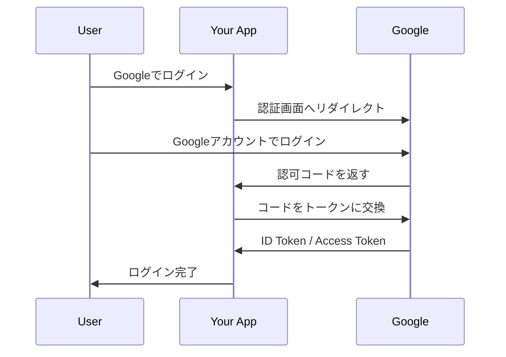

## 21.2 設定

```yaml
spring:
  security:
    oauth2:
      client:
        registration:
          google:
            client-id: ${GOOGLE_CLIENT_ID}
            client-secret: ${GOOGLE_CLIENT_SECRET}
            scope:
              - openid
              - profile
              - email
```

## 21.3 SecurityConfig

```java
@Configuration
public class GoogleLoginSecurityConfig {

    @Bean
    SecurityFilterChain securityFilterChain(HttpSecurity http) throws Exception {
        return http
                .authorizeHttpRequests(auth -> auth
                        .requestMatchers("/", "/login").permitAll()
                        .anyRequest().authenticated()
                )
                .oauth2Login(Customizer.withDefaults())
                .logout(Customizer.withDefaults())
                .build();
    }
}
```

## 21.4 ログインユーザー情報を取得する

```java
@RestController
@RequestMapping("/api")
public class GoogleLoginController {

    @GetMapping("/me")
    public Map<String, Object> me(@AuthenticationPrincipal OidcUser user) {
        return Map.of(
                "sub", user.getSubject(),
                "email", user.getEmail(),
                "name", user.getFullName()
        );
    }
}
```

## 21.5 初回ログイン時にDBへユーザー作成する考え方

Googleログインで入ってきたユーザーも、アプリ内のユーザーとして保存したい場合があります。

```text
Googleで認証成功
↓
emailやsubを取得
↓
DBに同じsubのユーザーがいるか確認
↓
いなければ作成
↓
いれば更新
```

重要なのは、Googleの`sub`を外部IDとして保存することです。

```java
@Entity
public class AppUser {

    @Id
    @GeneratedValue
    private Long id;

    private String provider; // google

    private String providerUserId; // OIDCのsub

    private String email;

    private String name;
}
```

## 21.6 SPAでGoogleログインを使う場合の注意

ReactなどのSPAでGoogleログインを使う場合、構成が複雑になります。

代表的な選択肢です。

```text
案A: Spring Bootでoauth2Loginし、Session Cookieを使う
案B: フロントがGoogleログインし、バックエンドがID Tokenを検証する
案C: BFFを置き、ブラウザにはHttpOnly Cookieだけを持たせる
```

最初の学習では、案Aが理解しやすいです。

## 21.7 演習問題

1. GoogleログインはOAuth2だけでなく何を使いますか？
2. Googleログインでアプリはパスワードを保存しますか？
3. OIDCの`sub`は何を表しますか？
4. `scope: openid profile email` の意味を説明してください。
5. Googleログインしたユーザーを自分のDBに保存する理由を考えてください。

---

# Part 6 Webセキュリティの実務基礎

---

# 第22章 CSRF

## 22.1 概念

CSRFは、Cross-Site Request Forgeryの略です。

ログイン済みユーザーに、意図しないリクエストを送らせる攻撃です。

Cookieはブラウザが自動で送るため、Cookie認証では特に注意が必要です。

## 22.2 図解

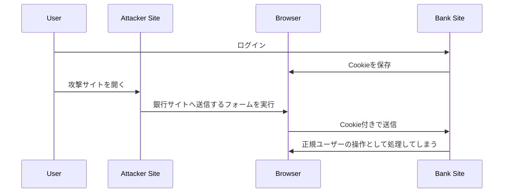

## 22.3 対策

- CSRFトークン
- SameSite Cookie
- 重要操作で再認証
- CORSを正しく設定
- JSON APIでも油断しない

## 22.4 Spring Security

Spring Securityは、デフォルトでCSRF対策を有効にします。

ただし、JWTをAuthorizationヘッダーで送る完全ステートレスAPIでは、CSRFを無効にする構成もあります。

```java
http.csrf(csrf -> csrf.disable());
```

ただし、Cookieを使う認証では安易に無効化しないでください。

## 22.5 演習問題

1. CSRFとは何ですか？
2. Cookie認証でCSRFが問題になりやすい理由を説明してください。
3. CSRFトークンは何のために使いますか？
4. SameSite Cookieは何を制御しますか？
5. Spring SecurityのCSRFを無効化してよいケースを説明してください。

---

# 第23章 CORS

## 23.1 概念

CORSは、Cross-Origin Resource Sharingの略です。

ブラウザが、別オリジンへのリクエストを制御する仕組みです。

オリジンとは、次の3つの組み合わせです。

```text
スキーム + ホスト + ポート
```

例です。

```text
http://localhost:3000
http://localhost:8080
```

これはポートが違うので別オリジンです。

Reactが`localhost:3000`、Spring Bootが`localhost:8080`で動いていると、CORSの対象になります。

## 23.2 HTTPメッセージ例

ブラウザはプリフライトリクエストを送ることがあります。

```http
OPTIONS /api/todos HTTP/1.1
Origin: http://localhost:3000
Access-Control-Request-Method: POST
```

サーバーが許可します。

```http
HTTP/1.1 200 OK
Access-Control-Allow-Origin: http://localhost:3000
Access-Control-Allow-Methods: GET,POST,PUT,DELETE
```

## 23.3 Spring Bootコード

```java
@Configuration
public class CorsConfig {

    @Bean
    CorsConfigurationSource corsConfigurationSource() {
        CorsConfiguration config = new CorsConfiguration();
        config.setAllowedOrigins(List.of("http://localhost:3000"));
        config.setAllowedMethods(List.of("GET", "POST", "PUT", "PATCH", "DELETE", "OPTIONS"));
        config.setAllowedHeaders(List.of("Authorization", "Content-Type"));
        config.setAllowCredentials(true);

        UrlBasedCorsConfigurationSource source = new UrlBasedCorsConfigurationSource();
        source.registerCorsConfiguration("/api/**", config);
        return source;
    }
}
```

SecurityConfig側でも有効化します。

```java
http.cors(Customizer.withDefaults());
```

## 23.4 よくあるミス

```text
Access-Control-Allow-Origin: *
Access-Control-Allow-Credentials: true
```

認証Cookieを使う場合、この組み合わせは危険です。

許可するOriginは具体的に指定しましょう。

## 23.5 演習問題

1. CORSとは何ですか？
2. オリジンは何の組み合わせですか？
3. `localhost:3000` と `localhost:8080` は同一オリジンですか？
4. プリフライトリクエストとは何ですか？
5. 認証Cookieを使う場合、CORS設定で注意すべきことを説明してください。

---

# 第24章 XSSとトークン保存

## 24.1 概念

XSSは、Cross-Site Scriptingの略です。

攻撃者がWebページに悪意あるJavaScriptを埋め込み、ユーザーのブラウザで実行させる攻撃です。

## 24.2 JWT保存場所の問題

SPAでJWTを使う場合、どこに保存するかが問題になります。

| 保存場所 | メリット | 注意点 |
|---|---|---|
| localStorage | 実装が簡単 | XSSで読まれやすい |
| sessionStorage | タブ単位で扱える | XSSで読まれやすい |
| HttpOnly Cookie | JSから読めない | CSRF対策が必要 |
| メモリ | 比較的安全 | リロードで消える |

## 24.3 基本方針

```text
XSSを防ぐ
+
トークンを長寿命にしない
+
Refresh Tokenを厳重に扱う
+
不要な情報をJWTに入れない
```

## 24.4 対策

- 入力値をHTMLとしてそのまま出力しない
- Reactの`dangerouslySetInnerHTML`を避ける
- CSPを設定する
- HttpOnly Cookieを検討する
- トークンの有効期限を短くする

## 24.5 演習問題

1. XSSとは何ですか？
2. localStorageにJWTを保存すると何が問題になりますか？
3. HttpOnly Cookieのメリットは何ですか？
4. HttpOnly Cookieを使う場合に注意すべき攻撃は何ですか？
5. トークンの有効期限を短くする理由を説明してください。

---

# 第25章 パスワード管理

## 25.1 概念

パスワードは絶対に平文で保存してはいけません。

DBが漏洩したとき、全ユーザーのパスワードがそのまま流出するからです。

## 25.2 ハッシュ化

パスワード保存では、復号できる暗号化ではなく、ハッシュ化を使います。

```text
password123
↓
$2a$10$....
```

ログイン時は、入力されたパスワードを同じ方式で検証します。

```java
passwordEncoder.matches(rawPassword, passwordHash)
```

## 25.3 BCrypt

Spring Securityでは、学習・実務の入門としてBCryptがよく使われます。

```java
@Bean
PasswordEncoder passwordEncoder() {
    return new BCryptPasswordEncoder();
}
```

## 25.4 やってはいけないこと

- パスワードを平文保存する
- SHA-256をそのまま使う
- 自作ハッシュ方式を使う
- ログにパスワードを出す
- JWTにパスワードを入れる
- メールでパスワードを送る

## 25.5 演習問題

1. パスワードを平文保存してはいけない理由を説明してください。
2. 暗号化とハッシュ化の違いを説明してください。
3. Spring Securityでパスワードハッシュに使う代表的なクラスは何ですか？
4. パスワードをログに出してはいけない理由を説明してください。
5. 自作ハッシュ方式を避けるべき理由を説明してください。

---

# Part 7 実践プロジェクト: 認証つきTodo API

---

# 第26章 作るもの

## 26.1 概要

最後に、認証つきTodo APIを作ります。

機能です。

- 会員登録
- ログイン
- 自分のユーザー情報取得
- Todo作成
- Todo一覧取得
- Todo更新
- Todo削除
- 管理者だけ使えるAPI
- Googleログインの理解

## 26.2 API一覧

| メソッド | URL | 認証 | 説明 |
|---|---|---|---|
| POST | `/api/auth/register` | 不要 | 会員登録 |
| POST | `/api/auth/login` | 不要 | ログイン |
| GET | `/api/me` | 必要 | 自分の情報 |
| GET | `/api/todos` | 必要 | 自分のTodo一覧 |
| POST | `/api/todos` | 必要 | Todo作成 |
| PUT | `/api/todos/{id}` | 必要 | Todo更新 |
| DELETE | `/api/todos/{id}` | 必要 | Todo削除 |
| GET | `/api/admin/users` | ADMIN | ユーザー一覧 |

## 26.3 全体構成

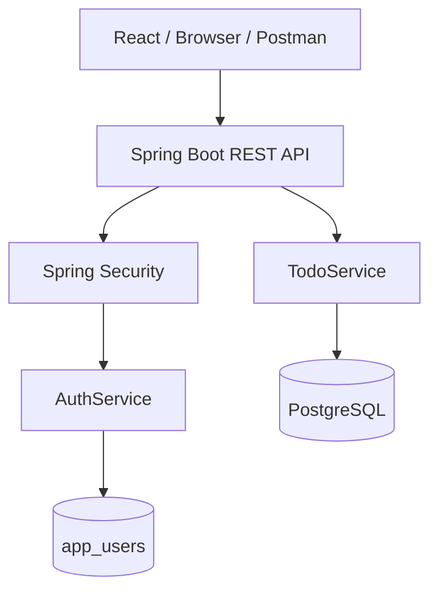

## 26.4 パッケージ構成

```text
src/main/java/com/example/todo
  ├── TodoApplication.java
  ├── auth
  │   ├── AuthController.java
  │   ├── AuthService.java
  │   ├── LoginRequest.java
  │   ├── LoginResponse.java
  │   └── RegisterRequest.java
  ├── user
  │   ├── AppUser.java
  │   └── AppUserRepository.java
  ├── todo
  │   ├── Todo.java
  │   ├── TodoController.java
  │   ├── TodoRepository.java
  │   ├── TodoService.java
  │   └── dto
  ├── security
  │   ├── SecurityConfig.java
  │   └── CustomUserDetailsService.java
  └── common
      ├── ApiError.java
      └── ApiExceptionHandler.java
```

## 26.5 実装順序

おすすめの順番です。

```text
1. TodoのEntityとRepository
2. Todo CRUD API
3. バリデーション
4. エラーハンドリング
5. AppUserのEntityとRepository
6. 会員登録
7. Spring Security導入
8. ログイン
9. 認可
10. Googleログイン
```

---

# 第27章 Todo APIの実装

## 27.1 Entity

```java
@Entity
public class Todo {

    @Id
    @GeneratedValue(strategy = GenerationType.IDENTITY)
    private Long id;

    private Long ownerId;

    @Column(nullable = false)
    private String title;

    private boolean completed;

    protected Todo() {
    }

    public Todo(Long ownerId, String title) {
        this.ownerId = ownerId;
        this.title = title;
        this.completed = false;
    }

    public void update(String title, boolean completed) {
        this.title = title;
        this.completed = completed;
    }

    public Long getId() {
        return id;
    }

    public Long getOwnerId() {
        return ownerId;
    }

    public String getTitle() {
        return title;
    }

    public boolean isCompleted() {
        return completed;
    }
}
```

## 27.2 Repository

```java
public interface TodoRepository extends JpaRepository<Todo, Long> {
    List<Todo> findByOwnerIdOrderByIdDesc(Long ownerId);
}
```

## 27.3 DTO

```java
public record CreateTodoRequest(
        @NotBlank
        @Size(max = 100)
        String title
) {}
```

```java
public record UpdateTodoRequest(
        @NotBlank
        @Size(max = 100)
        String title,

        boolean completed
) {}
```

```java
public record TodoResponse(
        Long id,
        String title,
        boolean completed
) {
    public static TodoResponse from(Todo todo) {
        return new TodoResponse(todo.getId(), todo.getTitle(), todo.isCompleted());
    }
}
```

## 27.4 Service

```java
@Service
public class TodoService {

    private final TodoRepository todoRepository;

    public TodoService(TodoRepository todoRepository) {
        this.todoRepository = todoRepository;
    }

    @Transactional(readOnly = true)
    public List<TodoResponse> findMyTodos(Long userId) {
        return todoRepository.findByOwnerIdOrderByIdDesc(userId)
                .stream()
                .map(TodoResponse::from)
                .toList();
    }

    @Transactional
    public TodoResponse create(Long userId, CreateTodoRequest request) {
        Todo todo = new Todo(userId, request.title());
        return TodoResponse.from(todoRepository.save(todo));
    }

    @Transactional
    public TodoResponse update(Long userId, Long todoId, UpdateTodoRequest request) {
        Todo todo = todoRepository.findById(todoId)
                .orElseThrow(() -> new TodoNotFoundException(todoId));

        if (!todo.getOwnerId().equals(userId)) {
            throw new AccessDeniedException("Not owner");
        }

        todo.update(request.title(), request.completed());
        return TodoResponse.from(todo);
    }

    @Transactional
    public void delete(Long userId, Long todoId) {
        Todo todo = todoRepository.findById(todoId)
                .orElseThrow(() -> new TodoNotFoundException(todoId));

        if (!todo.getOwnerId().equals(userId)) {
            throw new AccessDeniedException("Not owner");
        }

        todoRepository.delete(todo);
    }
}
```

## 27.5 Controller

```java
@RestController
@RequestMapping("/api/todos")
public class TodoController {

    private final TodoService todoService;

    public TodoController(TodoService todoService) {
        this.todoService = todoService;
    }

    @GetMapping
    public List<TodoResponse> findMyTodos(Authentication authentication) {
        Long userId = Long.valueOf(authentication.getName());
        return todoService.findMyTodos(userId);
    }

    @PostMapping
    public ResponseEntity<TodoResponse> create(
            Authentication authentication,
            @Valid @RequestBody CreateTodoRequest request
    ) {
        Long userId = Long.valueOf(authentication.getName());
        TodoResponse response = todoService.create(userId, request);
        return ResponseEntity.status(HttpStatus.CREATED).body(response);
    }

    @PutMapping("/{id}")
    public TodoResponse update(
            Authentication authentication,
            @PathVariable Long id,
            @Valid @RequestBody UpdateTodoRequest request
    ) {
        Long userId = Long.valueOf(authentication.getName());
        return todoService.update(userId, id, request);
    }

    @DeleteMapping("/{id}")
    public ResponseEntity<Void> delete(
            Authentication authentication,
            @PathVariable Long id
    ) {
        Long userId = Long.valueOf(authentication.getName());
        todoService.delete(userId, id);
        return ResponseEntity.noContent().build();
    }
}
```

## 27.6 演習問題

1. Todoに`ownerId`が必要な理由を説明してください。
2. 自分以外のTodoを更新できないようにする処理はどこに書いていますか？
3. 削除成功時に204を返す理由を説明してください。
4. `@Transactional(readOnly = true)` の意味を調べて説明してください。
5. Controllerで`Authentication`を受け取る理由を説明してください。

---

# 第28章 テスト観点

## 28.1 APIテストで見ること

ログイン機能つきAPIでは、最低限次をテストします。

- 未ログインでアクセスすると401
- 一般ユーザーで管理者APIにアクセスすると403
- 不正な入力で400
- 存在しないIDで404
- 正常作成で201
- 正常削除で204
- 自分のTodoだけ取得できる
- 他人のTodoは更新できない

## 28.2 MockMvcのイメージ

```java
@WebMvcTest(TodoController.class)
class TodoControllerTest {

    @Autowired
    MockMvc mockMvc;

    @Test
    void 未ログインなら401() throws Exception {
        mockMvc.perform(get("/api/todos"))
                .andExpect(status().isUnauthorized());
    }
}
```

## 28.3 演習問題

1. 認証が必要なAPIで未ログインなら何番を期待しますか？
2. 権限不足なら何番を期待しますか？
3. 入力エラーなら何番を期待しますか？
4. APIテストでステータスコードを見る理由を説明してください。
5. 自分のTodoだけ取得できることをどうテストしますか？

---

# Part 8 チートシート

---

# HTTPメソッド早見表

| メソッド | 意味 |
|---|---|
| GET | 取得 |
| POST | 作成 |
| PUT | 全体更新 |
| PATCH | 一部更新 |
| DELETE | 削除 |
| OPTIONS | 通信オプション確認 |
| HEAD | ヘッダーのみ取得 |

---

# HTTPステータスコード早見表

| コード | 意味 |
|---|---|
| 200 | OK |
| 201 | Created |
| 204 | No Content |
| 301 | Moved Permanently |
| 400 | Bad Request |
| 401 | Unauthorized |
| 403 | Forbidden |
| 404 | Not Found |
| 409 | Conflict |
| 422 | Unprocessable Content |
| 500 | Internal Server Error |
| 503 | Service Unavailable |

---

# 認証・認可早見表

| 用語 | 意味 |
|---|---|
| 認証 | あなたは誰か |
| 認可 | 何をしてよいか |
| Cookie | ブラウザ保存の小さなデータ |
| Session | サーバー側の状態管理 |
| JWT | 署名付きトークン |
| OAuth2 | 認可フレームワーク |
| OpenID Connect | OAuth2上の認証レイヤー |
| Access Token | APIアクセス用トークン |
| ID Token | 認証結果を表すトークン |
| Refresh Token | Access Token再発行用トークン |

---

# Spring Security用語早見表

| 用語 | 意味 |
|---|---|
| SecurityFilterChain | セキュリティ処理の流れ |
| Authentication | 認証済みユーザー情報 |
| SecurityContext | 認証情報の保存場所 |
| UserDetailsService | ユーザー情報を読み込む |
| PasswordEncoder | パスワードハッシュ化・検証 |
| @PreAuthorize | メソッド単位の認可 |
| oauth2Login | OAuth2/OIDCログイン |
| oauth2ResourceServer | JWTなどのBearer Token検証 |

---

# ログイン機能実装チェックリスト

## 会員登録

- [ ] メールアドレス形式を検証する
- [ ] パスワード長を検証する
- [ ] メールアドレス重複を確認する
- [ ] パスワードをハッシュ化する
- [ ] 平文パスワードを保存しない
- [ ] 登録成功時は201を返す

## ログイン

- [ ] ユーザーをメールアドレスで検索する
- [ ] パスワードを`matches`で検証する
- [ ] 失敗時のエラーを詳細にしすぎない
- [ ] 成功時にSessionまたはTokenを発行する
- [ ] トークンに秘密情報を入れない

## 認可

- [ ] 未ログインは401
- [ ] 権限不足は403
- [ ] 管理者APIを保護する
- [ ] 自分のデータだけ操作できるようにする
- [ ] Service層でも所有者チェックをする

## セキュリティ

- [ ] HTTPSを前提にする
- [ ] CookieにはHttpOnlyを付ける
- [ ] CookieにはSecureを付ける
- [ ] CookieにはSameSiteを検討する
- [ ] CSRF対策を理解して設定する
- [ ] CORSを必要なOriginだけに制限する
- [ ] パスワードやトークンをログに出さない

---

# 最終演習

次の仕様を満たすAPI設計をしてください。

## 仕様

ユーザーはログイン後、自分のTodoを管理できます。

管理者は全ユーザーの一覧を見ることができます。

Googleログインも将来的に追加したいです。

## 問題

1. 必要なAPIエンドポイントを設計してください。
2. それぞれのHTTPメソッドを決めてください。
3. 認証が必要かどうかを書いてください。
4. ADMIN権限が必要なAPIを書いてください。
5. Cookie/Session/JWTのどれを採用するか決めて、理由を書いてください。
6. Googleログインを追加する場合、OAuth2とOpenID Connectのどちらが関係しますか？
7. CORSが問題になる構成を1つ説明してください。
8. CSRF対策が必要になる構成を1つ説明してください。
9. パスワード保存でやってはいけないことを3つ書いてください。
10. 401と403を使い分ける具体例を書いてください。

---

# おわりに

API、HTTP、REST、認証、認可は、最初は別々の知識に見えます。

しかし、ログイン機能を作ると全部つながります。

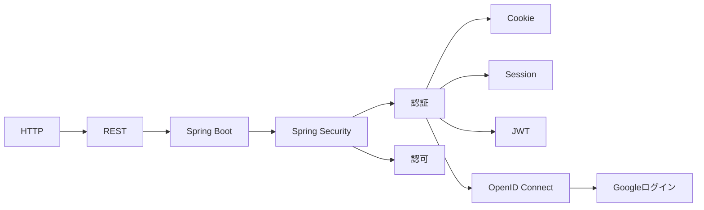

最初に目指すべき実装は、次のどちらかです。

```text
A. Session認証のTodoアプリ
B. JWT認証のTodo API
```

Googleログインは、その後に追加すると理解しやすいです。

学習順序としては、

```text
HTTP
↓
REST API
↓
Spring Boot Controller
↓
会員登録
↓
Session認証
↓
JWT認証
↓
OAuth2 / OpenID Connect
↓
Googleログイン
```

がおすすめです。

この順番で進めれば、ログイン機能は「魔法」ではなく、HTTPの上に積み上がった仕組みとして理解できます。
